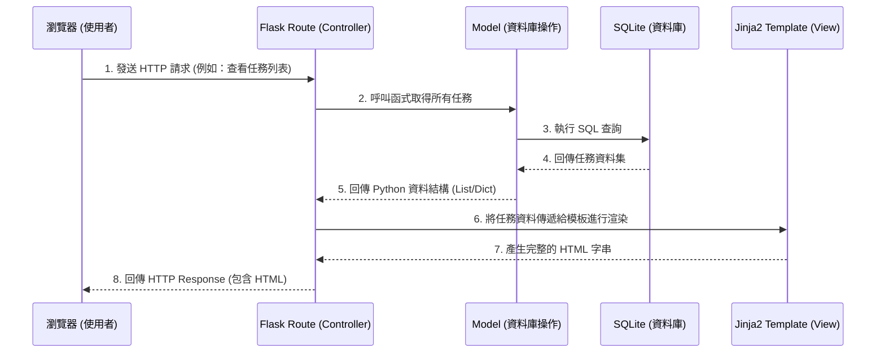

# 系統架構文件：任務管理系統

基於 `docs/PRD.md` 的功能需求，本文件定義了任務管理系統的技術架構、資料夾結構與元件之間的互動關係，為後續的開發工作提供清晰的藍圖。

## 1. 技術架構說明

本專案採用輕量級的 Python Web 解決方案，無前後端分離，所有頁面由後端統一渲染後回傳給客戶端。

### 選用技術與原因
- **後端框架：Flask (Python)**
  - **原因**：Flask 輕量且極具彈性，非常適合用來快速開發小型到中型的 Web 應用程式。任務管理系統的功能單純（CRUD 操作），Flask 的微框架特性可以讓我們專注於核心邏輯，避免不必要的複雜度。
- **視圖層（View）：Jinja2**
  - **原因**：Jinja2 是 Flask 內建支援的模板引擎，它能夠將後端取得的資料（如任務列表）動態渲染進 HTML 網頁中。這讓我們可以避免設定複雜的前端框架（如 React/Vue），快速達成頁面呈現的需求。
- **資料庫：SQLite**
  - **原因**：SQLite 是一個輕量級、無伺服器架構的資料庫引擎，且資料以單一檔案的形式儲存在本地端，非常適合 MVP 階段與小型應用，部署容易且不需要額外維護資料庫伺服器。

### MVC 模式實踐
本專案的設計會參考 MVC（Model-View-Controller）模式的思想來解耦程式碼：
- **Model（資料模型）**：負責與 SQLite 資料庫溝通，封裝對任務資料的 CRUD 操作（新增、編輯、刪除、查詢）。
- **View（視圖）**：使用 Jinja2 模板引擎，負責將最終的 HTML 畫面呈現給使用者。
- **Controller（控制器）**：由 Flask 的路由（Routes）擔任，負責接收使用者的請求（Request）、呼叫 Model 取得資料、處理商業邏輯後，將資料丟給 View 進行渲染，最後回傳回應（Response）。

## 2. 專案資料夾結構

本專案將採用以下模組化的資料夾結構，以利後續的開發與維護：

```text
web_app_development/
│
├── app/                        # 應用程式的主體邏輯
│   ├── models/                 # 資料庫模型與操作邏輯 (Model)
│   │   ├── __init__.py
│   │   └── task.py             # 封裝對 Task 資料表的 CRUD 操作
│   │
│   ├── routes/                 # Flask 路由處理 (Controller)
│   │   ├── __init__.py
│   │   └── task_routes.py      # 處理任務相關的請求 (GET/POST)
│   │
│   ├── templates/              # Jinja2 HTML 模板 (View)
│   │   ├── base.html           # 全站共用的佈局模板 (包含 header, footer)
│   │   └── task_list.html      # 顯示與操作任務列表的頁面
│   │
│   └── static/                 # 靜態資源檔案
│       ├── css/
│       │   └── style.css       # 系統的自定義樣式
│       └── js/
│           └── script.js       # (可選) 輔助用的前端腳本
│
├── instance/                   # 存放應用程式運行時產生的檔案
│   └── database.db             # SQLite 資料庫檔案
│
├── docs/                       # 專案說明文件
│   ├── PRD.md                  # 產品需求文件
│   └── ARCHITECTURE.md         # 系統架構文件 (本文件)
│
├── app.py                      # 系統啟動入口
└── requirements.txt            # Python 依賴套件清單
```

## 3. 元件關係圖

以下是系統各元件在處理使用者請求時的互動流程：



## 4. 關鍵設計決策

1. **無前端框架，完全依賴後端渲染**：
   - 為了加快開發速度並符合技術限制，我們不使用前後端分離架構。所有資料變更與頁面更新皆依賴瀏覽器發送傳統的表單（Form）或連結請求，由後端重新渲染整個頁面回傳。
2. **採用統一的全站共用模板 (`base.html`)**：
   - 利用 Jinja2 的模板繼承特性 (``)，將共用的 `<head>`、頁首與頁尾抽離，避免重複撰寫 HTML 代碼，未來要調整系統風格時只需修改一處。
3. **路由與模型的職責分離**：
   - 將資料庫的連線與 CRUD 操作封裝在 `models/task.py` 中，而不是直接寫在路由處理函式裡。這樣能讓 Flask 的路由程式碼更乾淨，專注於處理請求與回應的邏輯。
4. **本地開發與資料庫隔離**：
   - 將 SQLite 資料庫檔案存放於獨立的 `instance/` 資料夾，這符合 Flask 的最佳實踐。這類檔案不應隨原始碼一併放入版本控制中（可透過 `.gitignore` 排除），以避免團隊開發時資料庫衝突。
