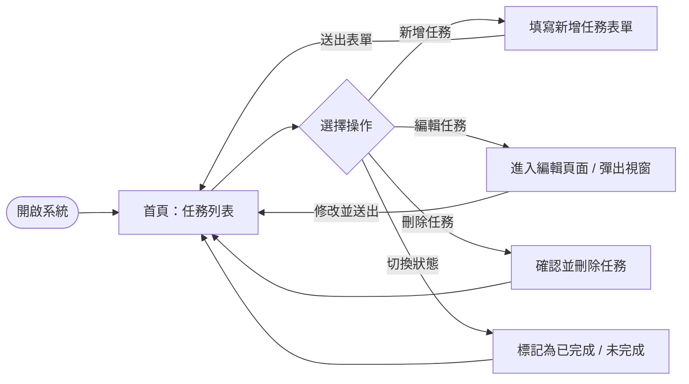
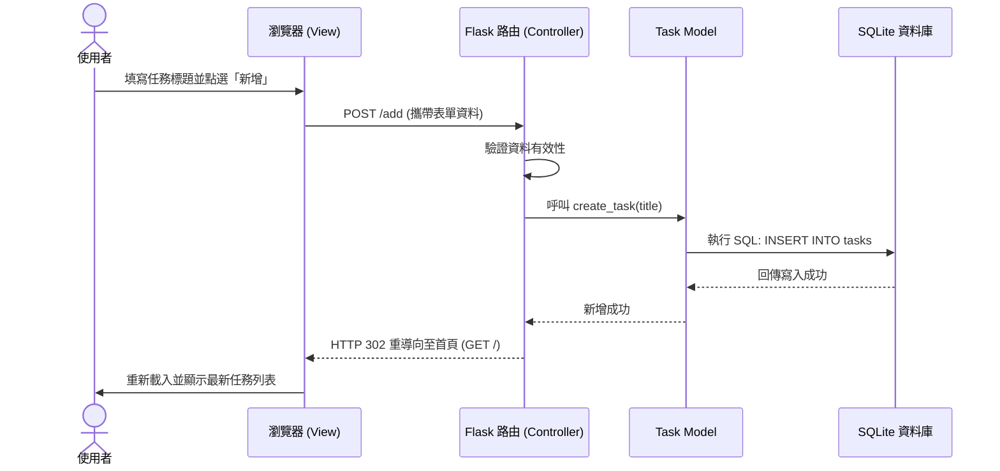

# 流程圖：任務管理系統

本文件根據 `docs/PRD.md` 與 `docs/ARCHITECTURE.md`，視覺化呈現任務管理系統的使用者操作路徑（User Flow）以及系統資料互動流程（System Flow）。

## 1. 使用者流程圖（User Flow）

描述使用者從進入系統到執行各項操作的完整路徑：

## 2. 系統序列圖（Sequence Diagram）

以下序列圖以「**使用者新增任務**」為例，展示系統各元件間的資料互動過程：

## 3. 功能清單對照表

列出 PRD 中的各項功能對應的 HTTP 方法與預期的 URL 路由設計：

| 功能名稱 | HTTP 方法 | URL 路徑 | 說明 |
| :--- | :--- | :--- | :--- |
| **檢視任務列表** | `GET` | `/` | 顯示所有任務清單（也是系統首頁） |
| **新增任務** | `POST` | `/add` | 接收表單並新增一筆任務，完成後重導回首頁 |
| **編輯任務頁面** | `GET` | `/edit/<task_id>` | 顯示特定任務的編輯表單頁面 |
| **更新任務資料** | `POST` | `/edit/<task_id>` | 接收變更並更新資料庫，完成後重導回首頁 |
| **刪除任務** | `POST` | `/delete/<task_id>` | 根據任務 ID 刪除資料，完成後重導回首頁 |
| **切換完成狀態** | `POST` | `/toggle/<task_id>` | 切換任務的「已完成/未完成」狀態，完成後重導回首頁 |
